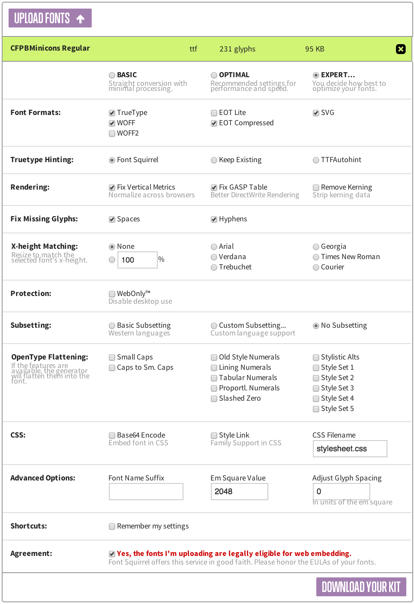

# Guidance on how to contribute

> All contributions to this project will be released under the CC0 public domain
> dedication. By submitting a pull request or filing a bug, issue, or
> feature request, you are agreeing to comply with this waiver of copyright interest.
> Details can be found in our [TERMS](TERMS.md) and [LICENCE](LICENSE).

There are two primary ways to help:
 - Using the issue tracker, and
 - Changing the code-base.

## Using the issue tracker

Use the issue tracker to suggest feature requests, report bugs, and ask questions.
This is also a great way to connect with the developers of the project as well
as others who are interested in this solution.

Use the issue tracker to find ways to contribute. Find a bug or a feature, mention in
the issue that you will take on that effort, then follow the _Changing the code-base_
guidance below.

## Changing the code-base

Generally speaking, you should fork this repository, make changes in your
own fork, and then submit a pull request. All new code should have associated unit
tests that validate implemented features and the presence or lack of defects.
Additionally, the code should follow any stylistic and architectural guidelines
prescribed by the project. In the absence of such guidelines, mimic the styles
and patterns in the existing code-base.

For Capital Framework-specific contributing guidelines please visit
<https://cfpb.github.io/capital-framework/contributing/>.

### Uploading new fonts

If you are contributing a new icon, please generate the associated webfonts
with your new font file.

We use Font Squirrel to generate webfonts.

1. Add your font source file (.ttf) to `src/font-source` folder

2. Visit [FontSquirrel WebFont Generator](http://www.fontsquirrel.com/tools/webfont-generator) and upload your .ttf file and our `generator_config.txt` file located in the font-source folder.

  

3. Check the box that certifies that these fonts are legal for web embedding and download your new fonts.

4. Add your webfonts to `src/fonts` folder.

5. Update `src/less/icons.less` with a description and css rule for each new icon.

6. Run `grunt` and `grunt vendor` to copy the fonts to their appropriate folders. You should have new files in `src/fonts`, `docs/fonts` and `demo/fonts`.

7. Take a screenshot of demo file and update `screenshot.png` to show off the newest icons.

After uploading the newest fonts, submit a pull request with your updates.
